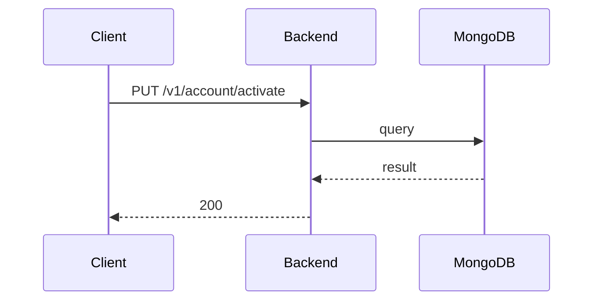

**Tag:** `Account` &nbsp;·&nbsp; **Operation:** `AccountController_activate`

## Purpose

Marks an account as active once the user proves ownership of the email address by submitting the verification code that was mailed to them. It is the second step of registration: the account exists in a pending state until this call succeeds. The endpoint is invoked from the verify-account screen during onboarding rather than from a Cubit method whose name the cross-link analyzer can match, which is why it shows no consumer here.

## Sequence

## Parameters

| Name | In | Required | Type | Description |
| ---- | -- | -------- | ---- | ----------- |
| `Content-Type` | header | no | `string` | application/json |

## Request body

Schema: [`ActivateAccountDto`](/data-model/activate-account-dto)

| Property | Type | Required | Description |
| -------- | ---- | -------- | ----------- |
| `verificationCode` | `string` | yes |  |

## Responses

- **200** — User status succesfully updated to ACTIVE — [`AccountLoggedDto`](/data-model/account-logged-dto)
- **400** — Some inputs are missed or wrong
- **429** — Too many requests, rate limit exceeded
- **500** — Error not handled

## Used by

_(no mobile screens detected calling this endpoint)_
