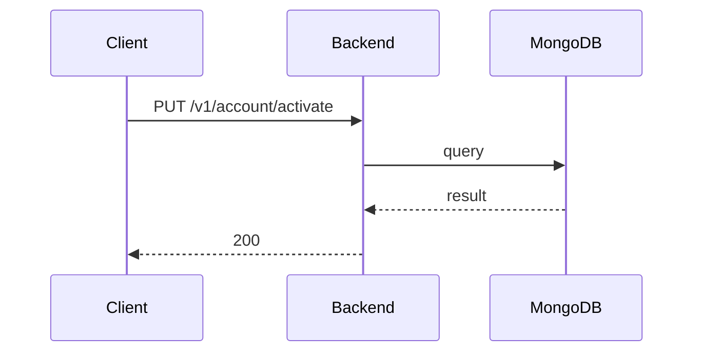

**Tag:** `Account` &nbsp;·&nbsp; **Operation:** `AccountController_activate`

## Purpose

> TODO (endpoint prose): run `npm run generate` with `ANTHROPIC_API_KEY` set to fill this in.

## Sequence

## Parameters

| Name | In | Required | Type | Description |
| ---- | -- | -------- | ---- | ----------- |
| `Content-Type` | header | no | `string` | application/json |

## Request body

Schema: [`ActivateAccountDto`](/data-model/activate-account-dto)

| Property | Type | Required | Description |
| -------- | ---- | -------- | ----------- |
| `verificationCode` | `string` | yes |  |

## Responses

- **200** — User status succesfully updated to ACTIVE — [`AccountLoggedDto`](/data-model/account-logged-dto)
- **400** — Some inputs are missed or wrong
- **429** — Too many requests, rate limit exceeded
- **500** — Error not handled

## Used by

_(no mobile screens detected calling this endpoint)_
