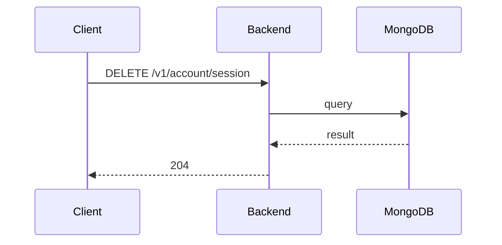

**Tag:** `Account` &nbsp;·&nbsp; **Operation:** `AccountController_closeAccountSession`

## Purpose

Ends the member's current session on the platform. It is the operation behind signing out: the device clears its local credentials and the server invalidates the bearer token, so a future request from that device cannot continue acting on the member's behalf. Sessions also end on long inactivity, but this is the explicit, member-initiated path.

## Sequence

## Parameters

| Name | In | Required | Type | Description |
| ---- | -- | -------- | ---- | ----------- |
| `Authorization` | header | yes | `string` | Bearer accessToken |
| `Content-Type` | header | no | `string` | application/json |

## Responses

- **204** — The current session has been closed successfully
- **400** — Some inputs are missed or wrong
- **429** — Too many requests, rate limit exceeded
- **500** — Error not handled

## Used by

_(no mobile screens detected calling this endpoint)_
