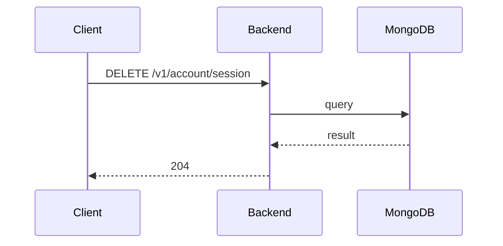

**Tag:** `Account` &nbsp;·&nbsp; **Operation:** `AccountController_closeAccountSession`

## Purpose

Invalidates the current bearer session on the server side. The mobile app fires it during logout, but the call is issued by the user repository's logout method rather than from a screen, so the cross-link analyzer does not surface it as a screen consumer.

## Sequence

## Parameters

| Name | In | Required | Type | Description |
| ---- | -- | -------- | ---- | ----------- |
| `Authorization` | header | yes | `string` | Bearer accessToken |
| `Content-Type` | header | no | `string` | application/json |

## Responses

- **204** — The current session has been closed successfully
- **400** — Some inputs are missed or wrong
- **429** — Too many requests, rate limit exceeded
- **500** — Error not handled

## Used by

_(no mobile screens detected calling this endpoint)_
