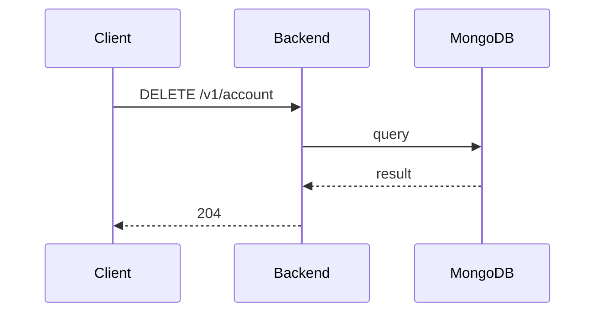

**Tag:** `Account` &nbsp;·&nbsp; **Operation:** `AccountController_deleteAccount`

## Purpose

Permanently closes a member's account at their explicit request. Deleting an account removes the profile, ends the session, drops the member from the participant list of every event they had joined, and discards any data the member had created that is exclusively theirs. The action is irreversible — the member must re-register from scratch if they ever want to come back — and is intentionally guarded behind a credential challenge so it cannot be triggered accidentally or by a stolen device.

## Sequence

## Parameters

| Name | In | Required | Type | Description |
| ---- | -- | -------- | ---- | ----------- |
| `Authorization` | header | yes | `string` | Bearer accessToken |
| `Content-Type` | header | no | `string` | application/json |

## Request body

Schema: [`DeleteAccountDto`](/data-model/delete-account-dto)

| Property | Type | Required | Description |
| -------- | ---- | -------- | ----------- |
| `password` | `string` | yes |  |

## Responses

- **204** — User account has been deleted successfully
- **400** — Some inputs are missed or wrong
- **401** — Invalid credentials
- **422** — Password is incorrect
- **429** — Too many requests, rate limit exceeded
- **500** — Error not handled

## Used by

_(no mobile screens detected calling this endpoint)_
