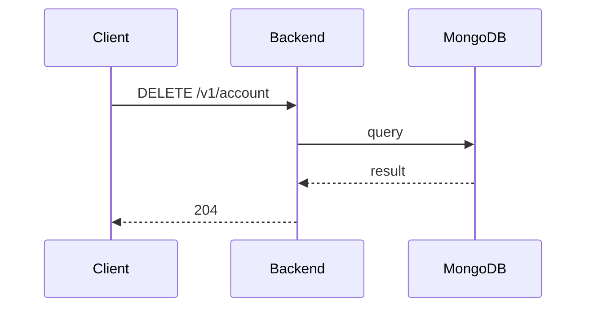

**Tag:** `Account` &nbsp;·&nbsp; **Operation:** `AccountController_deleteAccount`

## Purpose

Removes the authenticated account along with every record attached to it (sessions, joined events, profile data). The request takes a `DeleteAccountDto` so the client can confirm the destructive action with credentials. After a successful call the bearer session is invalidated and any cached state on the device should be cleared. No mobile screen consumes this endpoint in the current build; it is reserved for an account-deletion path that ships later.

## Sequence

## Parameters

| Name | In | Required | Type | Description |
| ---- | -- | -------- | ---- | ----------- |
| `Authorization` | header | yes | `string` | Bearer accessToken |
| `Content-Type` | header | no | `string` | application/json |

## Request body

Schema: [`DeleteAccountDto`](/data-model/delete-account-dto)

| Property | Type | Required | Description |
| -------- | ---- | -------- | ----------- |
| `password` | `string` | yes |  |

## Responses

- **204** — User account has been deleted successfully
- **400** — Some inputs are missed or wrong
- **401** — Invalid credentials
- **422** — Password is incorrect
- **429** — Too many requests, rate limit exceeded
- **500** — Error not handled

## Used by

_(no mobile screens detected calling this endpoint)_
