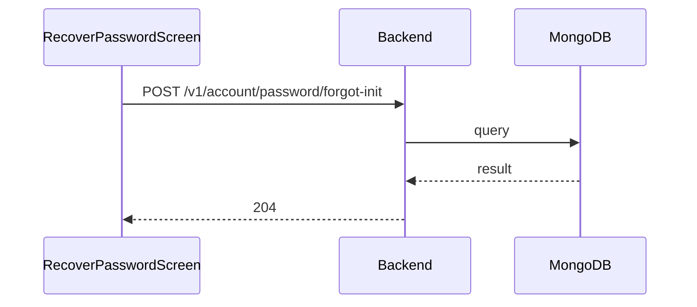

**Tag:** `Account` &nbsp;·&nbsp; **Operation:** `AccountController_forgotPassword`

## Purpose

Starts the recovery flow for a member who can't remember their password. The member submits the email they registered with and the system mails them a one-time code; the response is intentionally identical whether the email matches a real account or not, so the operation cannot be used to probe whether a given address has signed up. The member then enters that code on the reset-password screen to choose a new credential.

## Sequence

## Parameters

| Name | In | Required | Type | Description |
| ---- | -- | -------- | ---- | ----------- |
| `Content-Type` | header | no | `string` | application/json |

## Request body

Schema: [`EmailDto`](/data-model/email-dto)

| Property | Type | Required | Description |
| -------- | ---- | -------- | ----------- |
| `email` | `string` | yes |  |

## Responses

- **204** — The email for forgotten password has been sent successfully
- **400** — Some inputs are missed or wrong
- **429** — Too many requests, rate limit exceeded
- **500** — Error not handled

## Used by

- [`RecoverPasswordScreen`](/mobile/screens/recover-password-screen)
