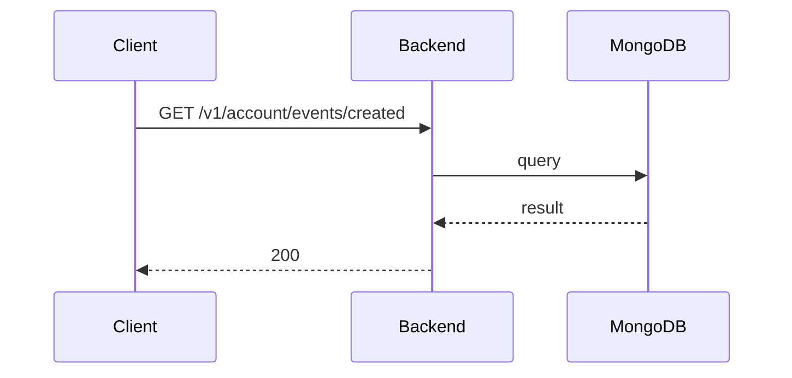

**Tag:** `Account` &nbsp;·&nbsp; **Operation:** `AccountController_getEventsCreatedByUser`

## Purpose

> TODO (endpoint prose): run `npm run generate` with `ANTHROPIC_API_KEY` set to fill this in.

## Sequence

## Parameters

| Name | In | Required | Type | Description |
| ---- | -- | -------- | ---- | ----------- |
| `Authorization` | header | yes | `string` | Bearer accessToken |
| `Content-Type` | header | no | `string` | application/json |

## Responses

- **200** — List of events created by the user — [`EventListWithCreatorFlagDto`](/data-model/event-list-with-creator-flag-dto)
- **401** — Invalid credentials
- **403** — Error for not have enough privileges
- **429** — Too many requests, rate limit exceeded
- **500** — Error not handled

## Used by

_(no mobile screens detected calling this endpoint)_
