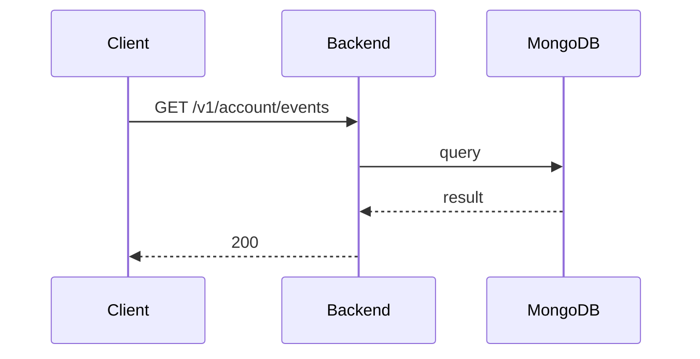

**Tag:** `Account` &nbsp;·&nbsp; **Operation:** `AccountController_getMyEvents`

## Purpose

> TODO (endpoint prose): run `npm run generate` with `ANTHROPIC_API_KEY` set to fill this in.

## Sequence

## Parameters

| Name | In | Required | Type | Description |
| ---- | -- | -------- | ---- | ----------- |
| `Authorization` | header | yes | `string` | Bearer accessToken |

## Responses

- **200** — List of available events user joined — [`EventListDto`](/data-model/event-list-dto)
- **401** — Invalid credentials
- **429** — Too many requests, rate limit exceeded
- **500** — Error not handled

## Used by

_(no mobile screens detected calling this endpoint)_
