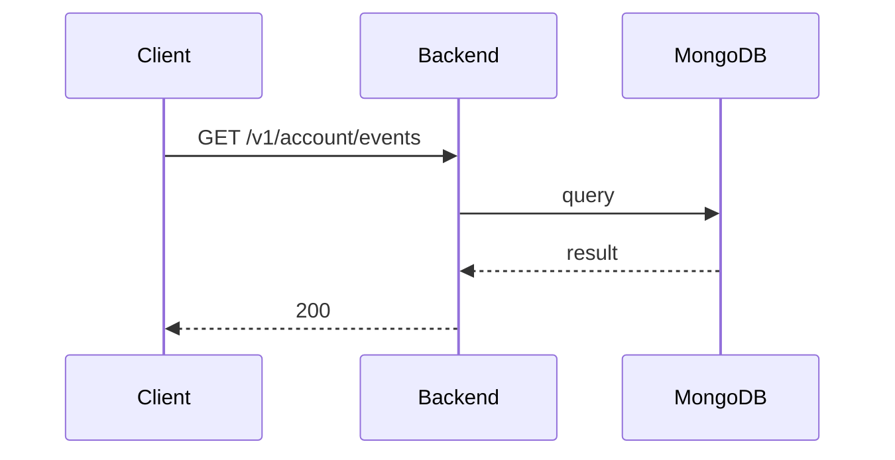

**Tag:** `Account` &nbsp;·&nbsp; **Operation:** `AccountController_getMyEvents`

## Purpose

Returns the events the authenticated user has joined and that have not yet been celebrated. The response excludes past events to keep the upcoming listing honest. The endpoint is reached through the events repository's cache-then-network path rather than from a screen call directly, which is why the analyzer does not list a consumer.

## Sequence

## Parameters

| Name | In | Required | Type | Description |
| ---- | -- | -------- | ---- | ----------- |
| `Authorization` | header | yes | `string` | Bearer accessToken |

## Responses

- **200** — List of available events user joined — [`EventListDto`](/data-model/event-list-dto)
- **401** — Invalid credentials
- **429** — Too many requests, rate limit exceeded
- **500** — Error not handled

## Used by

_(no mobile screens detected calling this endpoint)_
