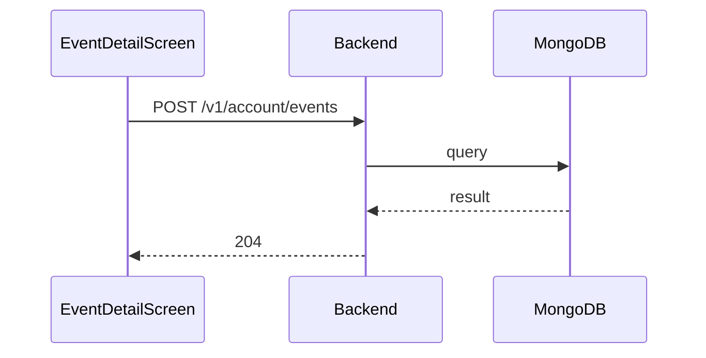

**Tag:** `Account` &nbsp;·&nbsp; **Operation:** `AccountController_joinEvent`

## Purpose

Registers the authenticated user as a participant in the event identified by the request payload. The backend rejects the call with a 422 when the event is full, which the mobile client surfaces to the user as a dedicated error. It is triggered from the event-detail screen when the user taps Join.

## Sequence

## Parameters

| Name | In | Required | Type | Description |
| ---- | -- | -------- | ---- | ----------- |
| `Authorization` | header | yes | `string` | Bearer accessToken |
| `Content-Type` | header | no | `string` | application/json |

## Request body

Schema: [`EventIdDto`](/data-model/event-id-dto)

| Property | Type | Required | Description |
| -------- | ---- | -------- | ----------- |
| `eventId` | `string` | yes |  |

## Responses

- **204** — User has successfully joined in the event
- **400** — Some inputs are missed or wrong
- **401** — Invalid credentials
- **406** — Can not join celebrated events
- **422** — The event is full
- **429** — Too many requests, rate limit exceeded
- **500** — Error not handled

## Used by

- [`EventDetailScreen`](/mobile/screens/event-detail-screen)
