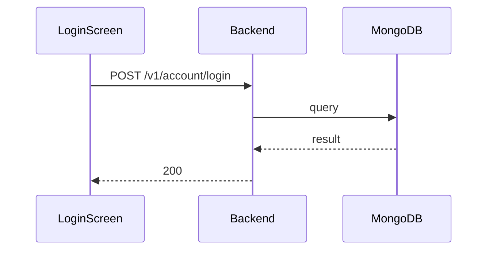

**Tag:** `Account` &nbsp;·&nbsp; **Operation:** `AccountController_login`

## Purpose

Lets a returning member prove who they are with their email and password so the system can grant them a session. It is the doorway to every other authenticated capability — joining events, voting, changing a password, viewing one's profile — none of which is reachable without first signing in. The operation only succeeds for accounts that have been activated; pending accounts get a different response so the client can route them back into the activate-account flow.

## Sequence

## Parameters

| Name | In | Required | Type | Description |
| ---- | -- | -------- | ---- | ----------- |
| `Content-Type` | header | no | `string` | application/json |

## Request body

Schema: [`AccountLoginDto`](/data-model/account-login-dto)

| Property | Type | Required | Description |
| -------- | ---- | -------- | ----------- |
| `email` | `string` | yes |  |
| `password` | `string` | yes |  |

## Responses

- **200** — User has successfully logged in — [`AccountLoggedDto`](/data-model/account-logged-dto)
- **400** — Some inputs are missed or wrong
- **401** — Invalid credentials
- **403** — User account is unverified
- **423** — User account is blocked
- **429** — Too many requests, rate limit exceeded
- **500** — Error not handled

## Used by

- [`LoginScreen`](/mobile/screens/login-screen)
