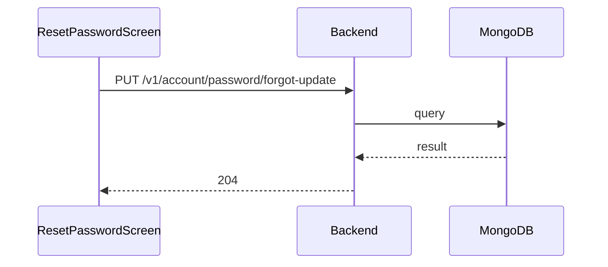

**Tag:** `Account` &nbsp;·&nbsp; **Operation:** `AccountController_passwordFotgotUpdate`

## Purpose

Closes out the forgotten-password flow. The member exchanges the one-time code they received by email for a fresh password of their choosing. Once it succeeds, every prior session is implicitly mistrusted — the member must sign in again with the new credential — which is the property that makes this flow safe to expose without prior authentication.

## Sequence

## Parameters

| Name | In | Required | Type | Description |
| ---- | -- | -------- | ---- | ----------- |
| `Content-Type` | header | no | `string` | application/json |

## Request body

Schema: [`UpdateForgotPasswordDto`](/data-model/update-forgot-password-dto)

| Property | Type | Required | Description |
| -------- | ---- | -------- | ----------- |
| `password` | `string` | yes |  |
| `forgotPasswordCode` | `string` | yes |  |

## Responses

- **204** — ForgotPasswordCode used to update password
- **400** — Some inputs are missed or wrong
- **429** — Too many requests, rate limit exceeded
- **500** — Error not handled

## Used by

- [`ResetPasswordScreen`](/mobile/screens/reset-password-screen)
