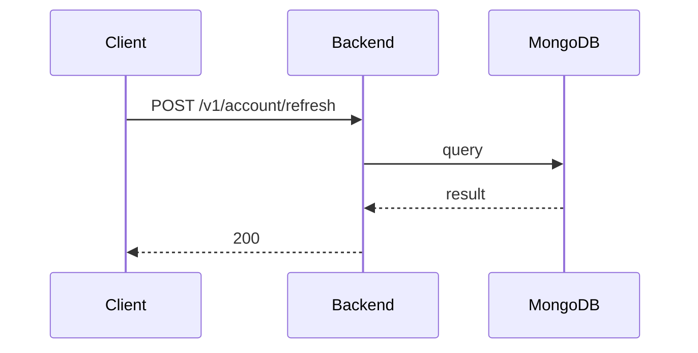

**Tag:** `Account` &nbsp;·&nbsp; **Operation:** `AccountController_refreshToken`

## Purpose

Extends a member's session without forcing them to type their password again. The app uses it transparently in the background whenever the current session is about to expire, which is what lets a member open the app days later and find themselves still signed in. Refresh is invisible by design — members never see this operation; they just experience continuity.

## Sequence

## Parameters

| Name | In | Required | Type | Description |
| ---- | -- | -------- | ---- | ----------- |
| `Content-Type` | header | no | `string` | application/json |

## Request body

Schema: [`RefreshTokenDto`](/data-model/refresh-token-dto)

| Property | Type | Required | Description |
| -------- | ---- | -------- | ----------- |
| `refreshToken` | `string` | yes |  |

## Responses

- **200** — A new pair of accesToken and refreshToken is succesfully provided — [`NewPairOfTokensDto`](/data-model/new-pair-of-tokens-dto)
- **400** — Some inputs are missed or wrong
- **401** — Invalid credentials
- **429** — Too many requests, rate limit exceeded
- **500** — Error not handled

## Used by

_(no mobile screens detected calling this endpoint)_
