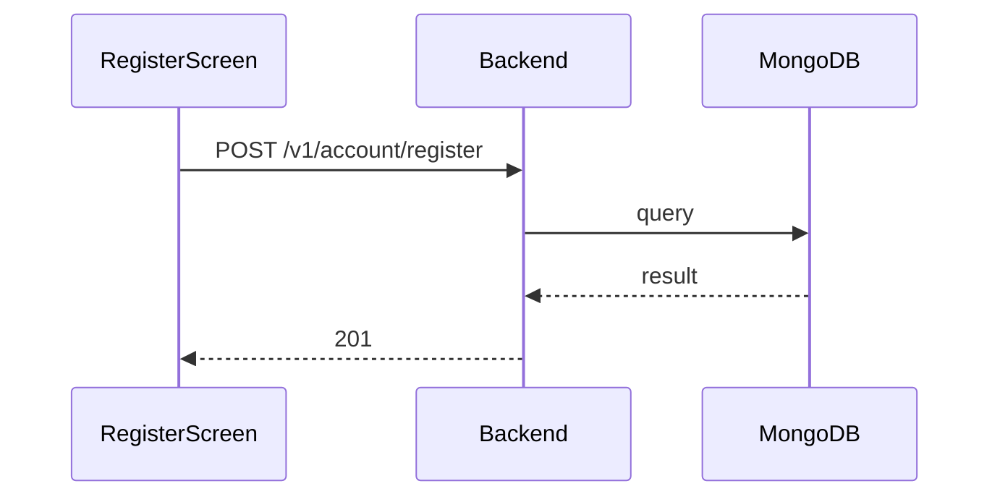

**Tag:** `Account` &nbsp;·&nbsp; **Operation:** `AccountController_register`

## Purpose

Creates a new account in a pending state and queues the verification email that begins the activate-account flow. The mobile register screen calls it once form validation has passed; success advances the user to the registration-confirmation screen where they enter the emailed code.

## Sequence

## Parameters

| Name | In | Required | Type | Description |
| ---- | -- | -------- | ---- | ----------- |
| `Content-Type` | header | no | `string` | application/json |

## Request body

Schema: [`AccountRegisterDto`](/data-model/account-register-dto)

| Property | Type | Required | Description |
| -------- | ---- | -------- | ----------- |
| `name` | `string` | yes |  |
| `lastName` | `string` | yes |  |
| `email` | `string` | yes |  |
| `password` | `string` | yes |  |

## Responses

- **201** — User has successfully created and verification email has been sent
- **400** — Some inputs are missed or wrong
- **500** — Error not handled

## Used by

- [`RegisterScreen`](/mobile/screens/register-screen)
