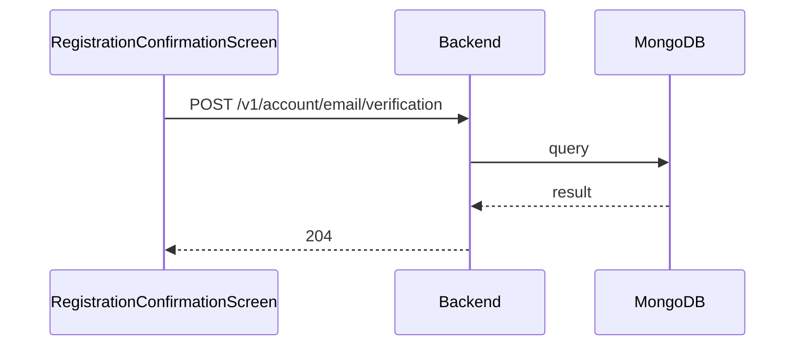

**Tag:** `Account` &nbsp;·&nbsp; **Operation:** `AccountController_sendEmailVerification`

## Purpose

Re-sends the verification email a pending member needs to activate their account. Members trigger it from the registration-confirmation screen when the code they received hasn't arrived, has expired, or has been lost. The system enforces a cooldown so the resend can only happen once the previous code has lapsed — this protects the member from a flood of competing codes and protects the platform from being used to spam an inbox.

## Sequence

## Parameters

| Name | In | Required | Type | Description |
| ---- | -- | -------- | ---- | ----------- |
| `Content-Type` | header | no | `string` | application/json |

## Request body

Schema: [`EmailDto`](/data-model/email-dto)

| Property | Type | Required | Description |
| -------- | ---- | -------- | ----------- |
| `email` | `string` | yes |  |

## Responses

- **204** — The email for verificate the account has been sent successfully
- **400** — Some inputs are missed or wrong
- **429** — Too many requests, rate limit exceeded
- **500** — Error not handled

## Used by

- [`RegistrationConfirmationScreen`](/mobile/screens/registration-confirmation-screen)
