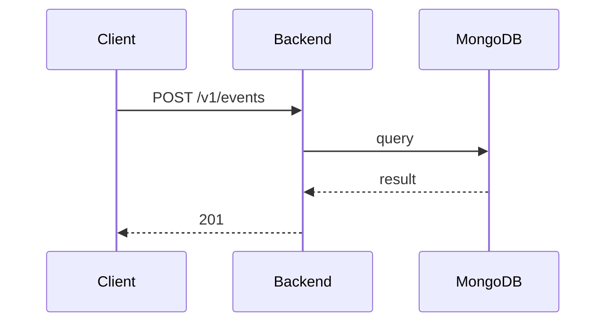

**Tag:** `Event` &nbsp;·&nbsp; **Operation:** `EventController_createEvent`

## Purpose

> TODO (endpoint prose): run `npm run generate` with `ANTHROPIC_API_KEY` set to fill this in.

## Sequence

## Parameters

| Name | In | Required | Type | Description |
| ---- | -- | -------- | ---- | ----------- |
| `Authorization` | header | yes | `string` | Bearer accessToken |
| `Content-Type` | header | no | `string` | application/json |

## Request body

Schema: [`CreateEventDto`](/data-model/create-event-dto)

| Property | Type | Required | Description |
| -------- | ---- | -------- | ----------- |
| `eventName` | `string` | yes |  |
| `eventDate` | `string` | yes |  |
| `description` | `string` | yes |  |
| `eventType` | `string` | yes |  |
| `imageUrl` | `string` | no |  |
| `location` | `CreateEventLocationDto` | yes |  |
| `tags` | `array` | no |  |
| `joinDeadline` | `string` | no |  |
| `maxCapacity` | `number` | no |  |

## Responses

- **201** — Event successfully created
- **400** — Some inputs are missed or wrong
- **401** — Invalid credentials
- **403** — Not enough privileges
- **429** — Too many requests, rate limit exceeded
- **500** — Error not handled

## Used by

_(no mobile screens detected calling this endpoint)_
