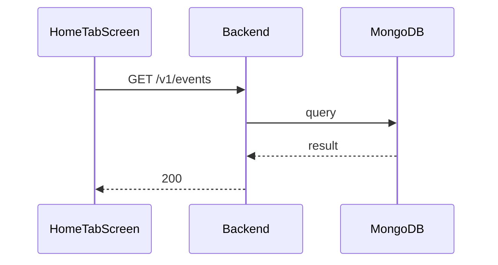

**Tag:** `Event` &nbsp;·&nbsp; **Operation:** `EventController_getEvents`

## Purpose

Returns the public catalogue of available events. It is the primary feed the home tab and my-events screens render from, and the only event-listing endpoint reachable without authentication.

## Sequence

## Parameters

| Name | In | Required | Type | Description |
| ---- | -- | -------- | ---- | ----------- |
| `Content-Type` | header | no | `string` | application/json |

## Responses

- **200** — List of available events — [`EventListDto`](/data-model/event-list-dto)
- **429** — Too many requests, rate limit exceeded
- **500** — Error not handled

## Used by

- [`HomeTabScreen`](/mobile/screens/home-tab-screen)
- [`MyEventsScreen`](/mobile/screens/my-events-screen)
