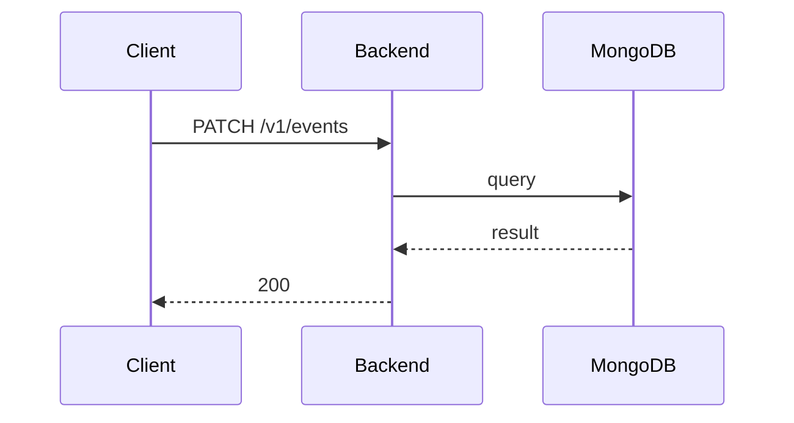

**Tag:** `Event` &nbsp;·&nbsp; **Operation:** `EventController_updateEvent`

## Purpose

Applies a partial update to an existing event. It is reserved for the event-organizer edit flow, which the current mobile build does not surface yet.

## Sequence

## Parameters

| Name | In | Required | Type | Description |
| ---- | -- | -------- | ---- | ----------- |
| `Authorization` | header | yes | `string` | Bearer accessToken |
| `Content-Type` | header | no | `string` | application/json |

## Request body

Schema: [`UpdateEventDto`](/data-model/update-event-dto)

| Property | Type | Required | Description |
| -------- | ---- | -------- | ----------- |
| `eventId` | `string` | yes |  |
| `eventName` | `string` | no |  |
| `eventDate` | `string` | no |  |
| `description` | `string` | no |  |
| `eventType` | `string` | no |  |
| `imageUrl` | `string` | no |  |
| `location` | `UpdateEventLocationDto` | no |  |
| `tags` | `array` | no |  |
| `joinDeadline` | `string` | no |  |
| `maxCapacity` | `number` | no |  |

## Responses

- **200** — Event successfully updated — [`EventDto`](/data-model/event-dto)
- **400** — Error for not existing event
- **401** — Invalid credentials
- **403** — Not enough privileges
- **429** — Too many requests, rate limit exceeded
- **500** — Error not handled

## Used by

_(no mobile screens detected calling this endpoint)_
