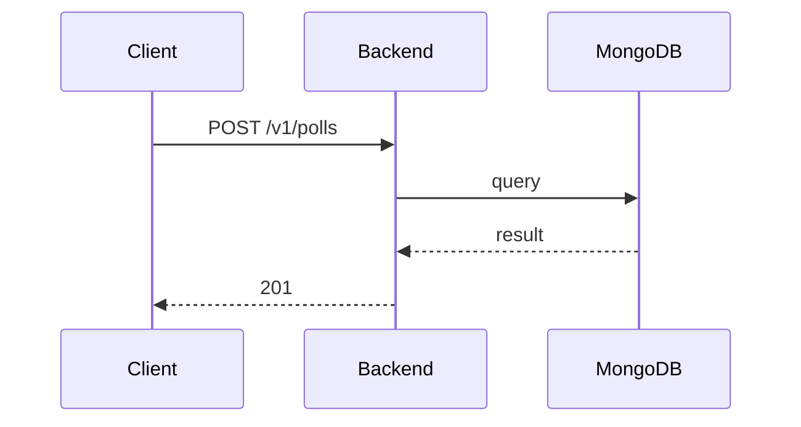

**Tag:** `Poll` &nbsp;·&nbsp; **Operation:** `PollController_createPoll`

## Purpose

> TODO (endpoint prose): run `npm run generate` with `ANTHROPIC_API_KEY` set to fill this in.

## Sequence

## Parameters

| Name | In | Required | Type | Description |
| ---- | -- | -------- | ---- | ----------- |
| `Authorization` | header | yes | `string` | Bearer accessToken |
| `Content-Type` | header | no | `string` | application/json |

## Request body

Schema: [`CreatePollDto`](/data-model/create-poll-dto)

| Property | Type | Required | Description |
| -------- | ---- | -------- | ----------- |
| `pollName` | `string` | yes |  |
| `description` | `string` | yes |  |
| `imageUrl` | `string` | no |  |
| `options` | `array` | yes |  |
| `voteDeadline` | `string` | yes |  |
| `isMultipleChoice` | `boolean` | yes |  |

## Responses

- **201** — Poll successfully created
- **400** — Some inputs are missed or wrong
- **401** — Invalid credentials
- **403** — Not enough privileges
- **500** — Error not handled

## Used by

_(no mobile screens detected calling this endpoint)_
