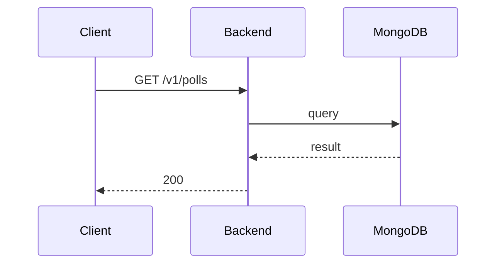

**Tag:** `Poll` &nbsp;·&nbsp; **Operation:** `PollController_getPolls`

## Purpose

Returns the catalogue of polls available to the authenticated user. It is fetched alongside the event listing on the home tab through a shared repository, but the mobile cubit does not call a method named to match the analyzer's heuristic, so it shows no consumer.

## Sequence

## Parameters

| Name | In | Required | Type | Description |
| ---- | -- | -------- | ---- | ----------- |
| `Authorization` | header | yes | `string` | Bearer accessToken |
| `Content-Type` | header | no | `string` | application/json |

## Responses

- **200** — List of available polls — [`PollListDto`](/data-model/poll-list-dto)
- **401** — Invalid credentials
- **500** — Error not handled

## Used by

_(no mobile screens detected calling this endpoint)_
