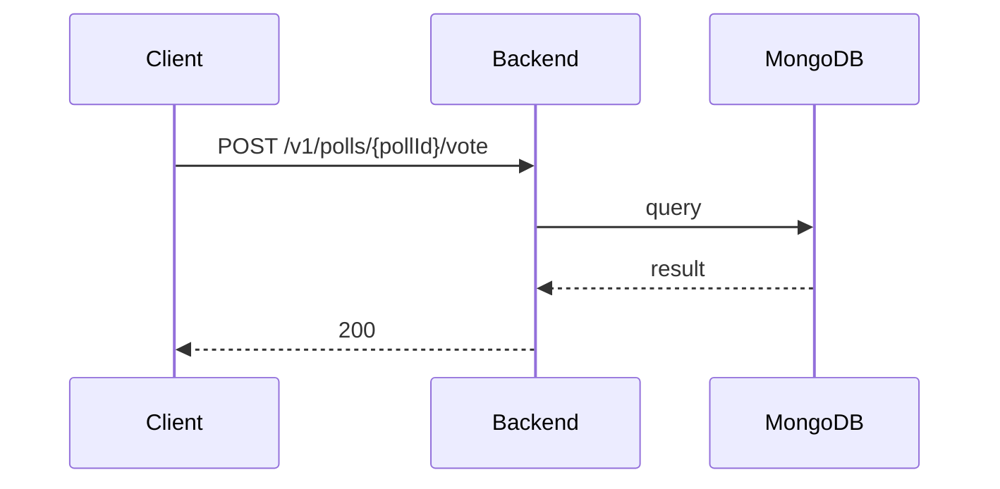

**Tag:** `Poll` &nbsp;·&nbsp; **Operation:** `PollController_votePoll`

## Purpose

Records a member's vote on a given poll. Each member can cast one vote per poll; submitting again replaces the previous selection rather than adding to it, so the tally always reflects the member's current opinion. The vote itself is private to the member who cast it — only aggregate results are visible to others.

## Sequence

## Parameters

| Name | In | Required | Type | Description |
| ---- | -- | -------- | ---- | ----------- |
| `pollId` | path | yes | `string` | Unique identifier of the poll |
| `Authorization` | header | yes | `string` | Bearer accessToken |
| `Content-Type` | header | no | `string` | application/json |

## Request body

Schema: [`VotePollDto`](/data-model/vote-poll-dto)

| Property | Type | Required | Description |
| -------- | ---- | -------- | ----------- |
| `selectedOptions` | `array` | yes |  |

## Responses

- **200** — Poll successfully voted — [`PollDto`](/data-model/poll-dto)
- **400** — Some inputs are missed or wrong
- **401** — Invalid credentials
- **404** — PollId not found
- **409** — Can not vote on past polls
- **422** — Too many options selected
- **429** — Too many requests, rate limit exceeded
- **500** — Error not handled

## Used by

_(no mobile screens detected calling this endpoint)_
