## System diagram

```mermaid
flowchart LR
  subgraph Mobile
    UI[Screens] --> CUBIT[Cubits]
    CUBIT --> REPO[Repositories]
  end
  subgraph Backend
    AccountModule[AccountModule]
    AccountSharedModule[AccountSharedModule]
    AppModule[AppModule]
    EventModule[EventModule]
    EventSharedModule[EventSharedModule]
    MongoDataAccessModule[MongoDataAccessModule]
    NoDataAccessModule[NoDataAccessModule]
    PollModule[PollModule]
    PollSharedModule[PollSharedModule]
    UsersModule[UsersModule]
    UsersSharedModule[UsersSharedModule]
  end
  REPO -->|HTTPS| Backend
  Backend -->|Mongoose| MONGO[(MongoDB)]
```

## Narrative

Esmorga is a two-tier product: a Flutter mobile app on the front end and a NestJS service backed by MongoDB on the back end. The mobile app is the only client; the backend exposes a versioned REST surface under `/v1` covering accounts, events, polls, and user lookup. There is no shared transport beyond HTTPS — the contract between the two halves is the OpenAPI document that the backend publishes as `swagger.json`.

On the mobile side, the app follows the Cubit/BLoC pattern. Each screen owns a single Cubit that holds an immutable `*State` object and emits new states in response to user input or asynchronous results. Cubits do not talk to the network directly; they delegate to a domain `*Repository` interface (for example `UserRepository`, `EventRepository`), and the implementation in the data layer (`*RepositoryImpl`) coordinates a local datasource for caching with a remote datasource for live reads. The repository pattern is what keeps screen logic uniform regardless of whether a request is served from the on-device cache or the network.

The remote datasources funnel every HTTP call through one of three concrete API clients — `EsmorgaGuestApi` for unauthenticated reads, `EsmorgaAuthApi` for the credential-handling endpoints (login, register, password reset), and `EsmorgaApi` for the authenticated bulk of the surface. Each client owns its own `http.Client` and constructs paths from a configured base URL plus a literal endpoint segment. This is the layer at which screen actions actually reach the backend.

The backend is organized into NestJS feature modules: `AccountModule`, `EventModule`, `PollModule`, and `UsersModule` each pair a controller with the services and providers it needs, while `*SharedModule` siblings expose Mongo-backed repositories that other modules can import. `MongoDataAccessModule` and `NoDataAccessModule` provide the persistence wiring, and an `AuthGuard` provider is referenced by every module that exposes authenticated endpoints.

Cross-cutting concerns visible from the structure: authentication is bearer-based (every authenticated endpoint declares an `Authorization` header), session lifecycle is split across a refresh-token endpoint and a session-close endpoint, and account state transitions (registration → email verification → activation → login) are explicitly modeled as separate operations. There is no GraphQL or websocket surface — all interaction is request/response REST.
