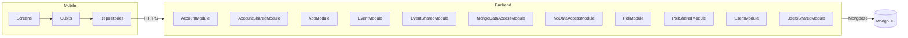

## System diagram

```mermaid
flowchart LR
  subgraph Mobile
    UI[Screens] --> CUBIT[Cubits]
    CUBIT --> REPO[Repositories]
  end
  subgraph Backend
    AccountModule[AccountModule]
    AccountSharedModule[AccountSharedModule]
    AppModule[AppModule]
    EventModule[EventModule]
    EventSharedModule[EventSharedModule]
    MongoDataAccessModule[MongoDataAccessModule]
    NoDataAccessModule[NoDataAccessModule]
    PollModule[PollModule]
    PollSharedModule[PollSharedModule]
    UsersModule[UsersModule]
    UsersSharedModule[UsersSharedModule]
  end
  REPO -->|HTTPS| Backend
  Backend -->|Mongoose| MONGO[(MongoDB)]
```

## Narrative

> TODO (architecture overview): run `npm run generate` with `ANTHROPIC_API_KEY` set to fill this in.
