## System diagram

```mermaid
flowchart LR
  subgraph Mobile
    UI[Screens] --> CUBIT[Cubits]
    CUBIT --> REPO[Repositories]
  end
  subgraph Backend
    AccountModule[AccountModule]
    AccountSharedModule[AccountSharedModule]
    AppModule[AppModule]
    EventModule[EventModule]
    EventSharedModule[EventSharedModule]
    MongoDataAccessModule[MongoDataAccessModule]
    NoDataAccessModule[NoDataAccessModule]
    PollModule[PollModule]
    PollSharedModule[PollSharedModule]
    UsersModule[UsersModule]
    UsersSharedModule[UsersSharedModule]
  end
  REPO -->|HTTPS| Backend
  Backend -->|Mongoose| MONGO[(MongoDB)]
```

## Narrative

Esmorga is a mobile-first product that helps a community discover, organize, and participate in local events. From a single phone, a member can browse upcoming events, sign up to attend, see who else is going, and propose new events of their own. The product also surfaces lightweight community polls so organizers can gather quick feedback alongside the event calendar.

The product is shaped around three actors. **Anonymous visitors** can browse the public event catalogue but cannot interact with it — joining, voting, and creating events all require an account. **Signed-in members** can join events, leave events they previously joined, vote on polls, and see their own attendance history. **Event organizers** are members who additionally own the events they create and can edit or remove them.

Account lifecycle is explicit and deliberate. A new member registers with an email and a password and lands in a pending state; the system emails them a one-time code, and only once they enter that code can they sign in. The same code-by-email pattern protects the forgotten-password flow, so a stale device never holds a credential the user has already reset. Sessions can be ended by signing out, by the system on inactivity, or by deleting the account entirely — which removes the member's profile and event participation along with it.

Events are the central object of the product. Each event has a title, a date and time, a location, a cover image, and a category. Members find events on the home tab, in their own "my events" tab once they've joined any, or by following a deep link. Capacity is a first-class business rule: an event can fill up, in which case the join action is rejected and the member sees a clear "event full" explanation rather than a generic error. Members can leave an event they joined at any time before it starts.

Polls run alongside events as a lightweight engagement tool. Each poll asks a single question with predefined options and accepts one vote per signed-in member. Organizers create polls, members vote on them, and results are visible to everyone — but the individual vote stays private to the voter.

A small but important design choice underpins the experience: most of what the user is reading at any given moment is served from a local cache on the device, with the network used to refresh in the background. This means the app stays usable when connectivity is poor — a member can scan their event list at a venue with weak signal — and only operations that genuinely change state (joining an event, voting, registering) require a successful network round-trip.
