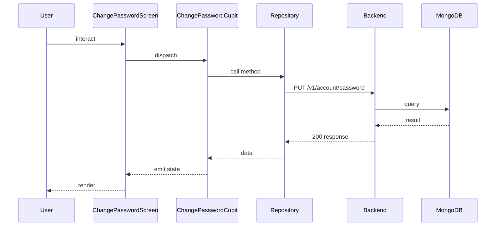

## Sequence

## Narrative

> TODO (flow prose): run `npm run generate` with `ANTHROPIC_API_KEY` set to fill this in.

## Components

- Screen: [`ChangePasswordScreen`](/mobile/screens/change-password-screen)
- Cubit: [`ChangePasswordCubit`](/mobile/state/change-password-cubit)
- Repository: _unknown_

## Endpoints

- [`PUT /v1/account/password`](/api/account/account-controller-update-password)
