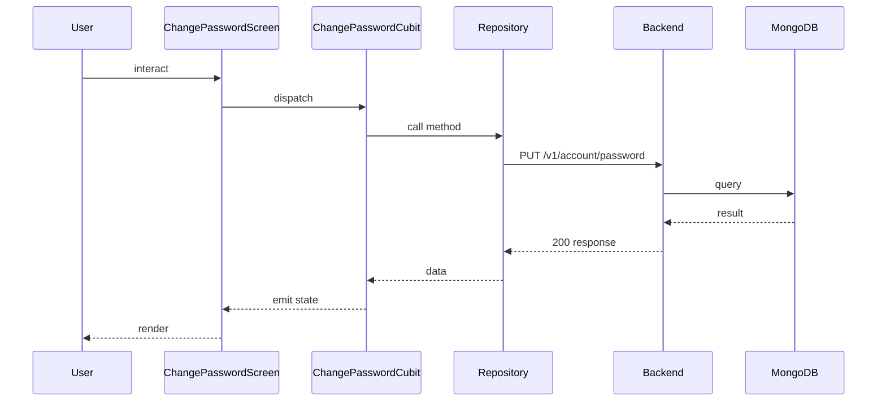

## Sequence

## Narrative

The user enters the change-password screen from the profile area, types their current password and a new one, and taps Save. `ChangePasswordCubit` validates the inputs locally before issuing the call.

Under the hood the cubit invokes `userRepository.changePassword`, which routes through the user repository implementation to the remote datasource and finally to `EsmorgaApi`'s `PUT /v1/account/password` call. A 200 ends the flow with a state that the screen renders as a success acknowledgement; an error response (typically a wrong current password) is surfaced as inline feedback.

## Components

- Screen: [`ChangePasswordScreen`](/mobile/screens/change-password-screen)
- Cubit: [`ChangePasswordCubit`](/mobile/state/change-password-cubit)
- Repository: _unknown_

## Endpoints

- [`PUT /v1/account/password`](/api/account/account-controller-update-password)
