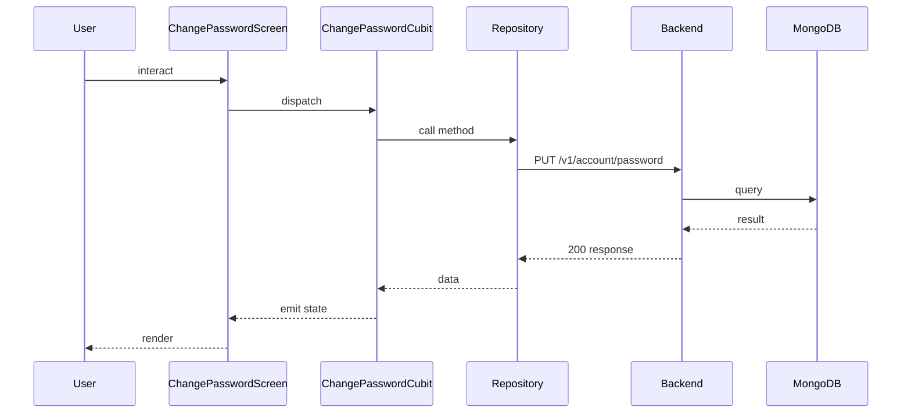

## Sequence

## Narrative

A signed-in member rotates their password from the profile area. They open the change-password screen, type their current password, choose a new one, confirm it, and tap Save.

The system verifies the current password to make sure the device's owner — not just whoever happens to have the unlocked phone — is the one making the change. On success the new password takes effect immediately for any future sign-in, and the screen acknowledges the change before returning the member to the profile area. On a wrong current password the screen surfaces the error inline so the member can try again without retyping the new one.

## Components

- Screen: [`ChangePasswordScreen`](/mobile/screens/change-password-screen)
- Cubit: [`ChangePasswordCubit`](/mobile/state/change-password-cubit)
- Repository: _unknown_

## Endpoints

- [`PUT /v1/account/password`](/api/account/account-controller-update-password)
