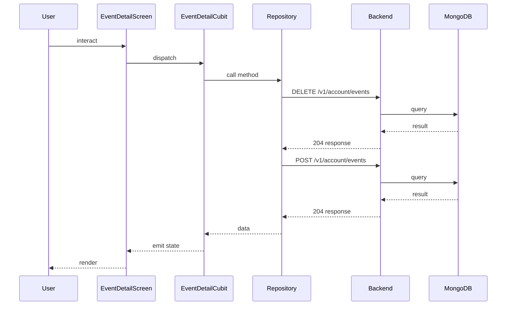

## Sequence

## Narrative

The user opens an event from any list and lands on the event-detail screen, which shows metadata, attendees, and a join/leave button. The button's label depends on whether the user is already in the participant list.

When the user joins, `EventDetailCubit.joinEvent` calls through the events repository to `POST /v1/account/events`; when they leave, `leaveEvent` issues `DELETE /v1/account/events`. Both calls go to the same path with different verbs and carry the event id in the body. The cubit re-emits the event with the updated participant state so the button label flips and the attendee count refreshes immediately.

## Components

- Screen: [`EventDetailScreen`](/mobile/screens/event-detail-screen)
- Cubit: [`EventDetailCubit`](/mobile/state/event-detail-cubit)
- Repository: _unknown_

## Endpoints

- [`DELETE /v1/account/events`](/api/account/account-controller-dis-join-event)
- [`POST /v1/account/events`](/api/account/account-controller-join-event)
