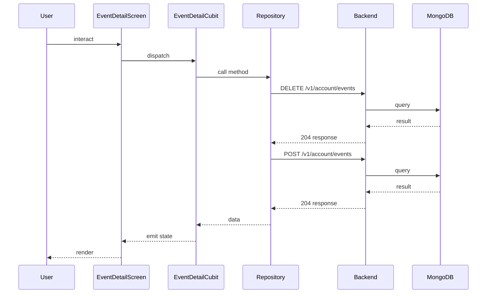

## Sequence

## Narrative

A member opens an event from any list and lands on the event-detail screen, where they see the event's date, location, description, attendees, and a primary action that reads either Join or Leave depending on whether they are already signed up.

When the member joins, the participant list and count update immediately so the social signal on the screen is honest. If the event has already filled up, the system rejects the join with an event-full explanation rather than a generic error, so the member knows exactly why the action didn't work. When the member leaves, the same screen reflects the change without a refresh, freeing the seat for someone else.

## Components

- Screen: [`EventDetailScreen`](/mobile/screens/event-detail-screen)
- Cubit: [`EventDetailCubit`](/mobile/state/event-detail-cubit)
- Repository: _unknown_

## Endpoints

- [`DELETE /v1/account/events`](/api/account/account-controller-dis-join-event)
- [`POST /v1/account/events`](/api/account/account-controller-join-event)
