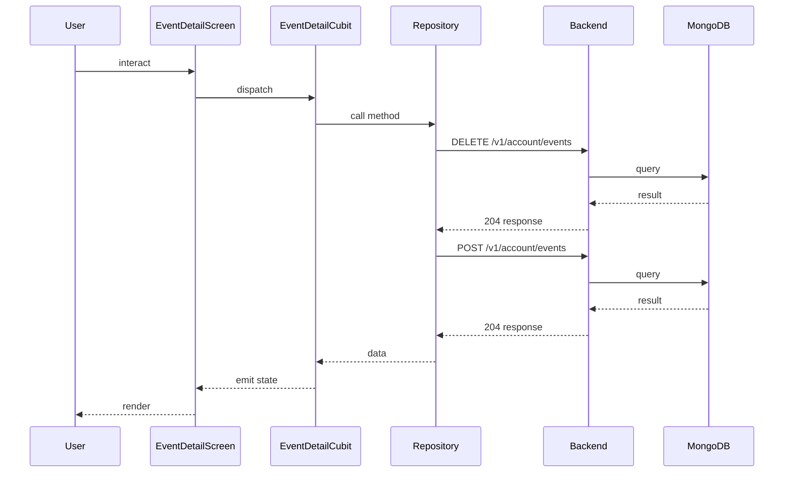

## Sequence

## Narrative

> TODO (flow prose): run `npm run generate` with `ANTHROPIC_API_KEY` set to fill this in.

## Components

- Screen: [`EventDetailScreen`](/mobile/screens/event-detail-screen)
- Cubit: [`EventDetailCubit`](/mobile/state/event-detail-cubit)
- Repository: _unknown_

## Endpoints

- [`DELETE /v1/account/events`](/api/account/account-controller-dis-join-event)
- [`POST /v1/account/events`](/api/account/account-controller-join-event)
