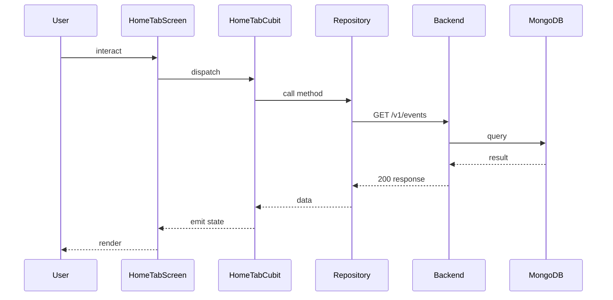

## Sequence

## Narrative

A signed-in member lands on the home tab and sees the combined feed of upcoming events and active polls.

The feed is assembled from the public event catalogue and the polls list, sorted chronologically so what's most imminent is most visible. Pulling down refreshes the data from the server; if the network is unavailable, the screen shows the most recent cached feed with a hint that a refresh failed, so the member is never left looking at a blank page when connectivity dips. From here members tap into individual events to learn more, or into a poll to weigh in.

## Components

- Screen: [`HomeTabScreen`](/mobile/screens/home-tab-screen)
- Cubit: [`HomeTabCubit`](/mobile/state/home-tab-cubit)
- Repository: _unknown_

## Endpoints

- [`GET /v1/events`](/api/event/event-controller-get-events)
