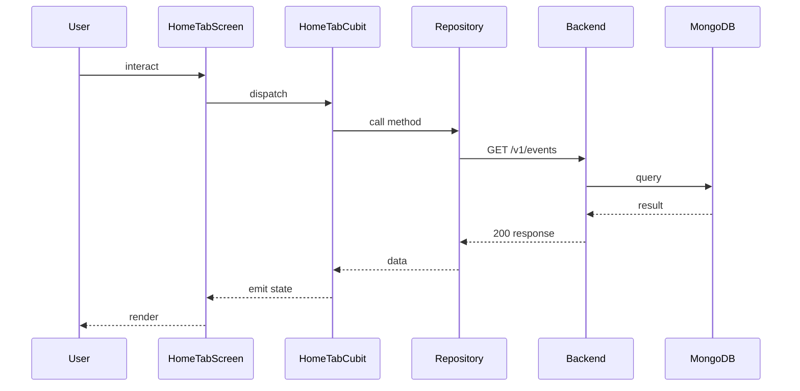

## Sequence

## Narrative

> TODO (flow prose): run `npm run generate` with `ANTHROPIC_API_KEY` set to fill this in.

## Components

- Screen: [`HomeTabScreen`](/mobile/screens/home-tab-screen)
- Cubit: [`HomeTabCubit`](/mobile/state/home-tab-cubit)
- Repository: _unknown_

## Endpoints

- [`GET /v1/events`](/api/event/event-controller-get-events)
