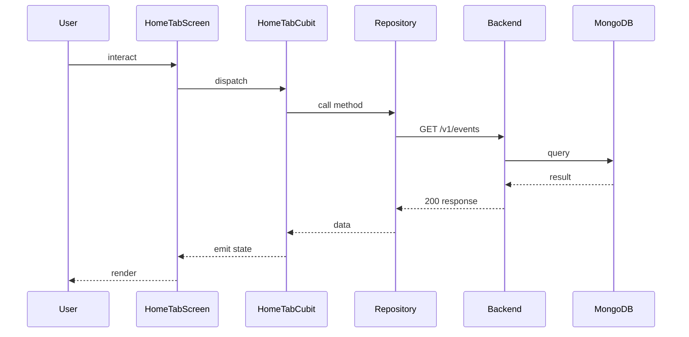

## Sequence

## Narrative

The user lands on the home tab after sign-in. `HomeTabCubit` reads the user from the local cache and concurrently fetches the events catalogue.

The events fetch resolves to `GET /v1/events` through the events repository (cache-then-network); the polls feed is loaded alongside it so the screen can render a single combined list. Once both arrive the cubit emits a populated state and the list renders; on a network failure the cubit emits an error state that the screen renders as a retry banner.

## Components

- Screen: [`HomeTabScreen`](/mobile/screens/home-tab-screen)
- Cubit: [`HomeTabCubit`](/mobile/state/home-tab-cubit)
- Repository: _unknown_

## Endpoints

- [`GET /v1/events`](/api/event/event-controller-get-events)
