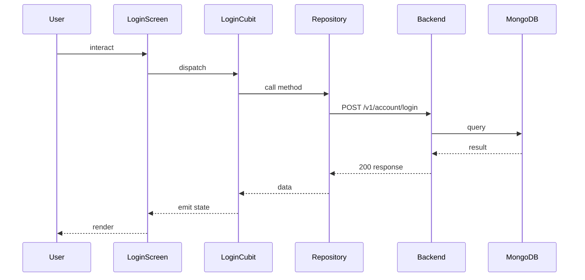

## Sequence

## Narrative

The user enters credentials on the login screen and taps Login. `LoginCubit` validates the email and password locally, marks the form as submitted, and dispatches.

The cubit calls `userRepository.login`, which traverses the user repository implementation, the remote datasource, and finally `EsmorgaAuthApi`'s `POST /v1/account/login` call. On success the returned token bundle is persisted and the cubit emits a success state that the screen converts into a navigation event into the authenticated home graph; on failure the screen renders the cubit's error state as an inline message.

## Components

- Screen: [`LoginScreen`](/mobile/screens/login-screen)
- Cubit: [`LoginCubit`](/mobile/state/login-cubit)
- Repository: _unknown_

## Endpoints

- [`POST /v1/account/login`](/api/account/account-controller-login)
