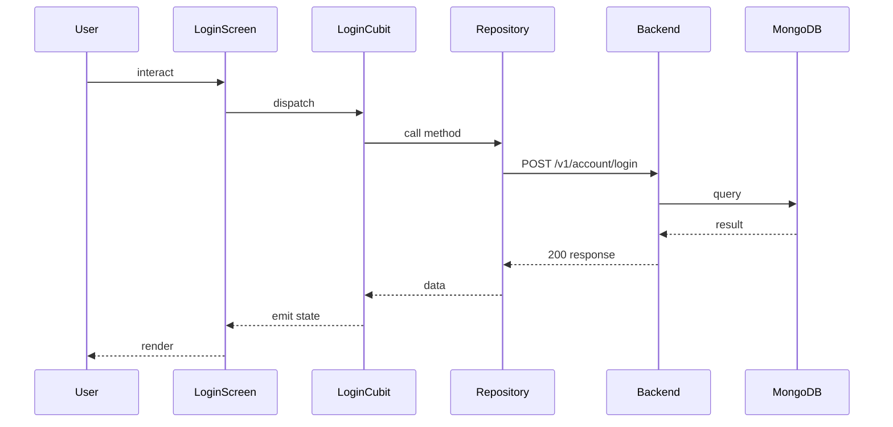

## Sequence

## Narrative

> TODO (flow prose): run `npm run generate` with `ANTHROPIC_API_KEY` set to fill this in.

## Components

- Screen: [`LoginScreen`](/mobile/screens/login-screen)
- Cubit: [`LoginCubit`](/mobile/state/login-cubit)
- Repository: _unknown_

## Endpoints

- [`POST /v1/account/login`](/api/account/account-controller-login)
