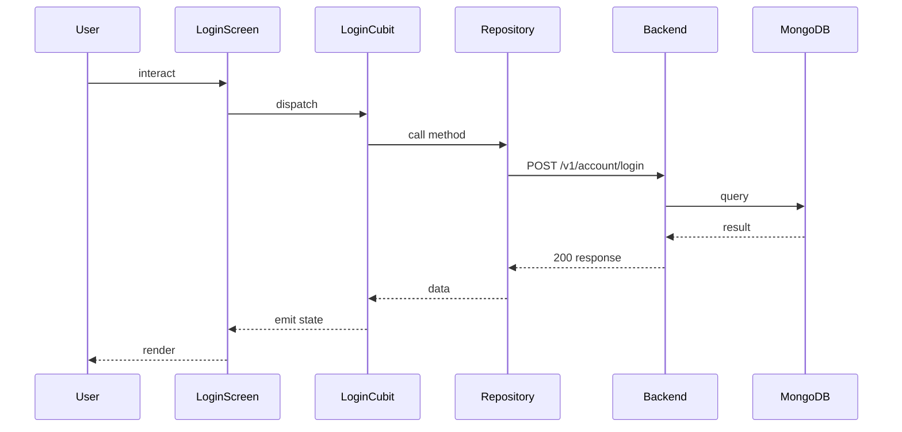

## Sequence

## Narrative

A returning member opens Esmorga and signs back in with the email and password they registered with.

If the credentials match an active account, the member lands on the home tab with their upcoming events and the public catalogue ready to browse, and the device transparently keeps the session alive in the background for as long as they keep using the app. If the credentials don't match an active account, the screen explains why inline — wrong password, unknown email, or pending-activation account — so the member knows exactly what to do next instead of being told a generic error.

## Components

- Screen: [`LoginScreen`](/mobile/screens/login-screen)
- Cubit: [`LoginCubit`](/mobile/state/login-cubit)
- Repository: _unknown_

## Endpoints

- [`POST /v1/account/login`](/api/account/account-controller-login)
