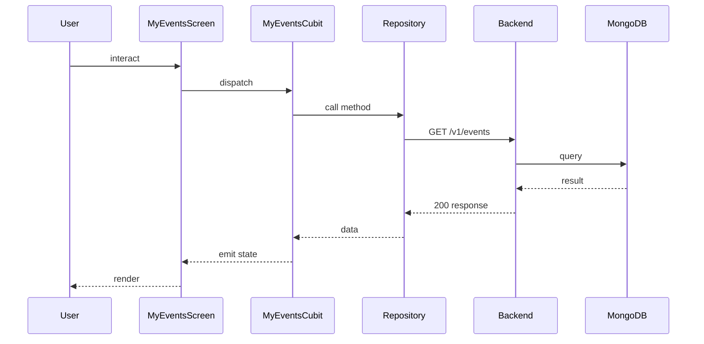

## Sequence

## Narrative

The user opens the My Events tab. `MyEventsCubit` reads the current user from the local cache and fetches the events feed.

The fetch resolves to `GET /v1/events` through the same events repository the home tab uses, with client-side filtering for events the user has joined. The cubit emits a populated state once the response is in; if the network fetch fails but the local cache is warm, the screen renders the cached list and shows a stale-data hint.

## Components

- Screen: [`MyEventsScreen`](/mobile/screens/my-events-screen)
- Cubit: [`MyEventsCubit`](/mobile/state/my-events-cubit)
- Repository: _unknown_

## Endpoints

- [`GET /v1/events`](/api/event/event-controller-get-events)
