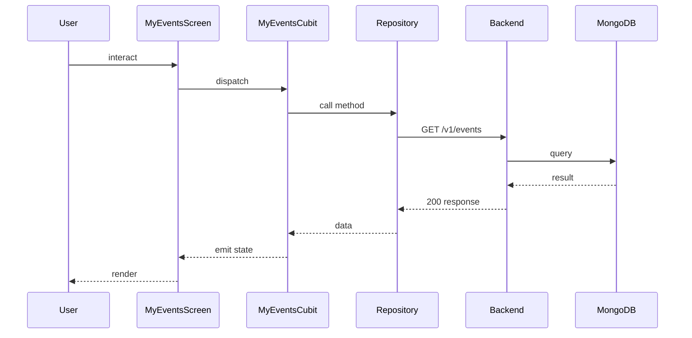

## Sequence

## Narrative

A member opens the My Events tab to see what they're committed to in the days and weeks ahead.

The list shows only upcoming events the member has joined, in chronological order, so the most imminent commitments are always at the top. Past events drop off automatically — the tab is forward-looking, not a history. If the member is offline but has used the tab recently, they still see their cached list with a stale-data hint so a poor signal at a venue doesn't cut them off from knowing where they need to be.

## Components

- Screen: [`MyEventsScreen`](/mobile/screens/my-events-screen)
- Cubit: [`MyEventsCubit`](/mobile/state/my-events-cubit)
- Repository: _unknown_

## Endpoints

- [`GET /v1/events`](/api/event/event-controller-get-events)
