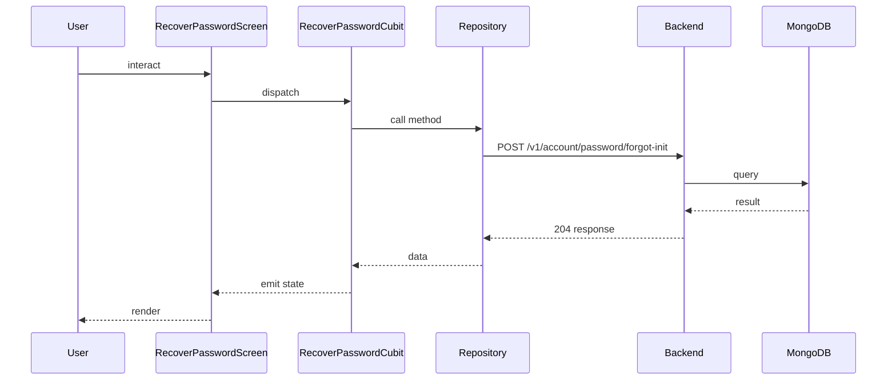

## Sequence

## Narrative

The user taps the forgotten-password link on the login screen and lands on the recover-password screen, where they enter their email. `RecoverPasswordCubit` validates the address and submits.

The cubit calls `userRepository.recoverPassword`, which routes to `POST /v1/account/password/forgot-init`. The backend always returns success once the request is queued — it does not reveal whether the email matches a real account — so the cubit emits a sent state that the screen renders as a confirmation, asking the user to check their inbox for the one-time code.

## Components

- Screen: [`RecoverPasswordScreen`](/mobile/screens/recover-password-screen)
- Cubit: [`RecoverPasswordCubit`](/mobile/state/recover-password-cubit)
- Repository: _unknown_

## Endpoints

- [`POST /v1/account/password/forgot-init`](/api/account/account-controller-forgot-password)
