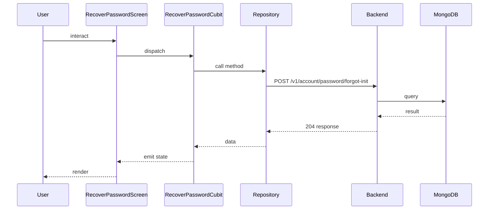

## Sequence

## Narrative

A member who can't remember their password starts the recovery flow from the login screen.

They type the email they registered with, the system mails them a one-time code, and the screen confirms that an email has been sent — without revealing whether the address matches a real account, on purpose, so the operation cannot be used to probe the platform. The member is told to check their inbox and then move on to the reset-password screen with the code in hand.

## Components

- Screen: [`RecoverPasswordScreen`](/mobile/screens/recover-password-screen)
- Cubit: [`RecoverPasswordCubit`](/mobile/state/recover-password-cubit)
- Repository: _unknown_

## Endpoints

- [`POST /v1/account/password/forgot-init`](/api/account/account-controller-forgot-password)
