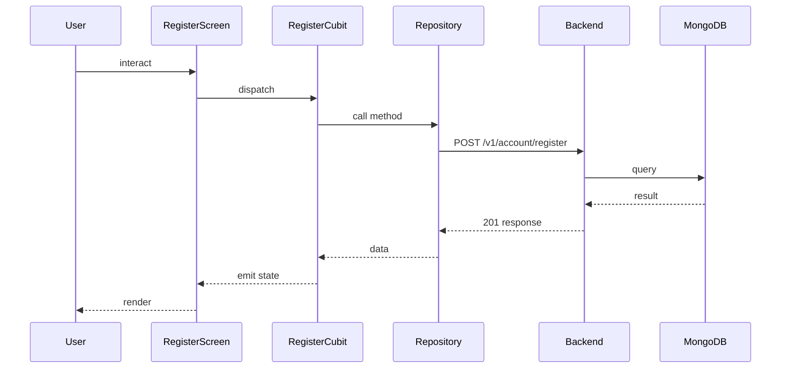

## Sequence

## Narrative

The user fills out the registration form and taps Sign up. `RegisterCubit` validates each field locally and only issues the call once the form is clean.

It invokes `userRepository.register`, which resolves to `POST /v1/account/register`. The backend creates the account in a pending state and queues the verification email. On success the cubit emits a state carrying the user's email; the screen reads that and navigates to the registration-confirmation screen, pre-filling the email so the user only has to type the code from their inbox.

## Components

- Screen: [`RegisterScreen`](/mobile/screens/register-screen)
- Cubit: [`RegisterCubit`](/mobile/state/register-cubit)
- Repository: _unknown_

## Endpoints

- [`POST /v1/account/register`](/api/account/account-controller-register)
