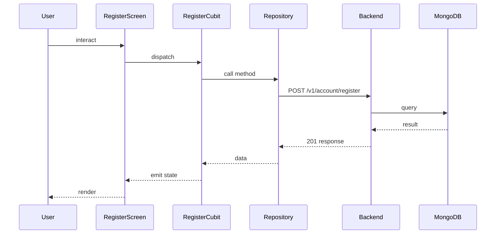

## Sequence

## Narrative

A prospective member creates an account so they can join the community.

They type their name, last name, email, and password; inline validation catches common mistakes (mismatched passwords, malformed emails) as they type, so they almost always submit a clean form. On success the system creates the account in a pending state and queues the verification email; the member is forwarded automatically to the registration-confirmation screen, with their email pre-filled, so the only thing left to do is enter the code from their inbox.

## Components

- Screen: [`RegisterScreen`](/mobile/screens/register-screen)
- Cubit: [`RegisterCubit`](/mobile/state/register-cubit)
- Repository: _unknown_

## Endpoints

- [`POST /v1/account/register`](/api/account/account-controller-register)
