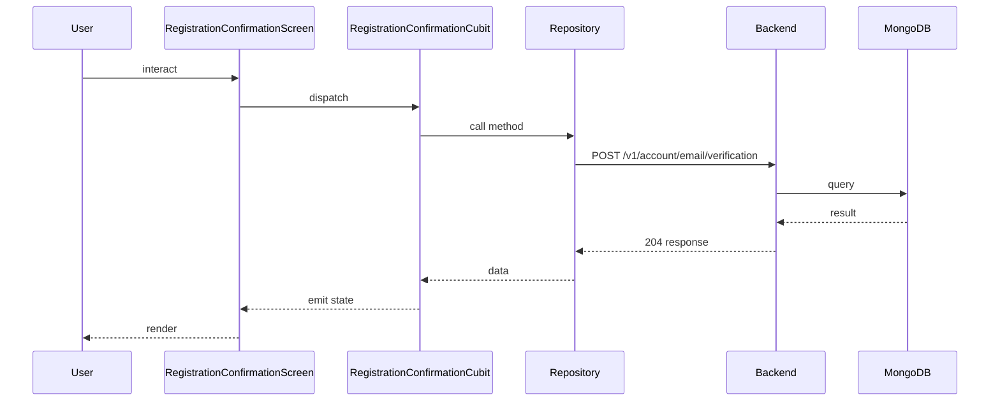

## Sequence

## Narrative

> TODO (flow prose): run `npm run generate` with `ANTHROPIC_API_KEY` set to fill this in.

## Components

- Screen: [`RegistrationConfirmationScreen`](/mobile/screens/registration-confirmation-screen)
- Cubit: [`RegistrationConfirmationCubit`](/mobile/state/registration-confirmation-cubit)
- Repository: _unknown_

## Endpoints

- [`POST /v1/account/email/verification`](/api/account/account-controller-send-email-verification)
