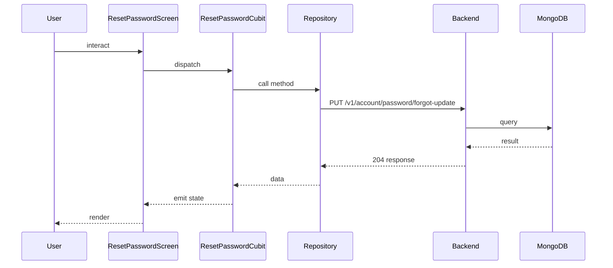

## Sequence

## Narrative

Triggered from the reset-password screen once the user has the one-time code from their inbox. They paste the code and enter a new password.

`ResetPasswordCubit` validates the new password and calls `userRepository.resetPassword`, which resolves to `PUT /v1/account/password/forgot-update`. On success the cubit emits a completion state that the screen renders as a confirmation and routes the user back to the login screen so they can sign in with the fresh credential.

## Components

- Screen: [`ResetPasswordScreen`](/mobile/screens/reset-password-screen)
- Cubit: [`ResetPasswordCubit`](/mobile/state/reset-password-cubit)
- Repository: _unknown_

## Endpoints

- [`PUT /v1/account/password/forgot-update`](/api/account/account-controller-password-fotgot-update)
