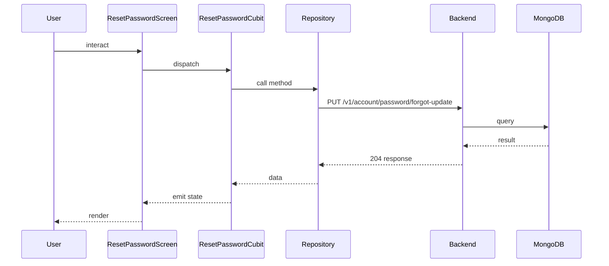

## Sequence

## Narrative

A member who started the forgotten-password flow finishes it on the reset-password screen.

They paste the one-time code from their inbox and type a new password; on success the system updates the credential and the screen routes the member back to login so they can sign in with the fresh password right away. The flow is deliberately one-shot — the same code cannot be reused — which is what lets the platform expose this recovery path without first asking the member to authenticate.

## Components

- Screen: [`ResetPasswordScreen`](/mobile/screens/reset-password-screen)
- Cubit: [`ResetPasswordCubit`](/mobile/state/reset-password-cubit)
- Repository: _unknown_

## Endpoints

- [`PUT /v1/account/password/forgot-update`](/api/account/account-controller-password-fotgot-update)
